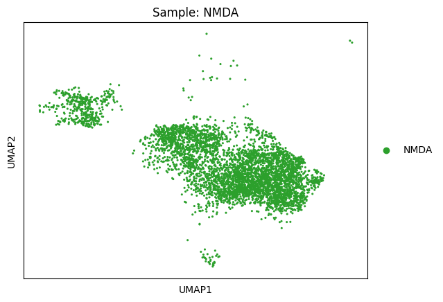
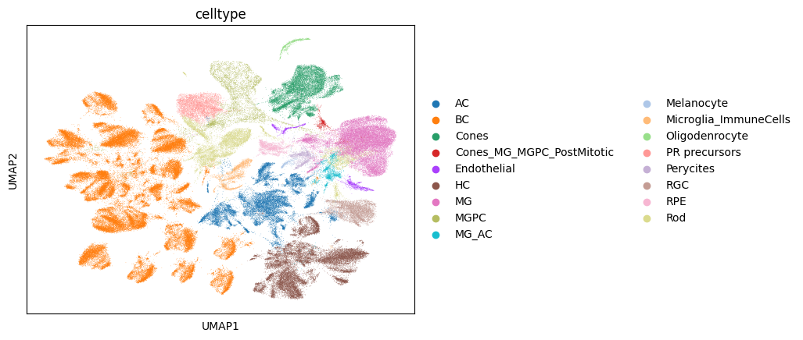
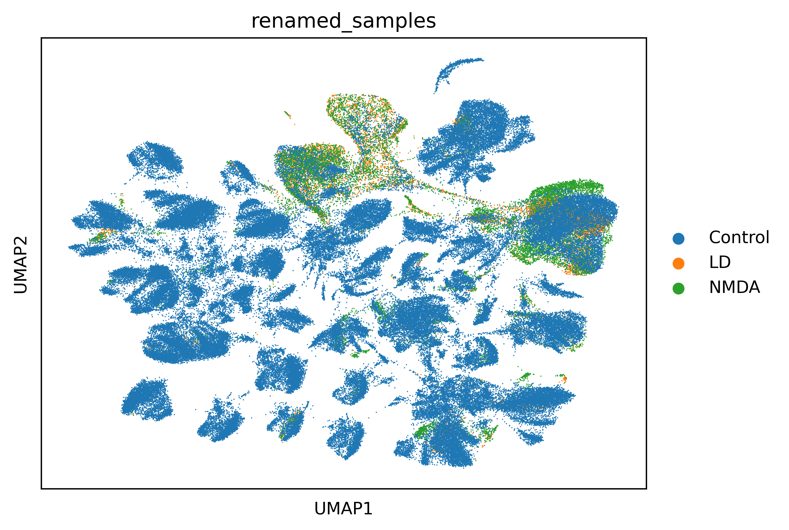
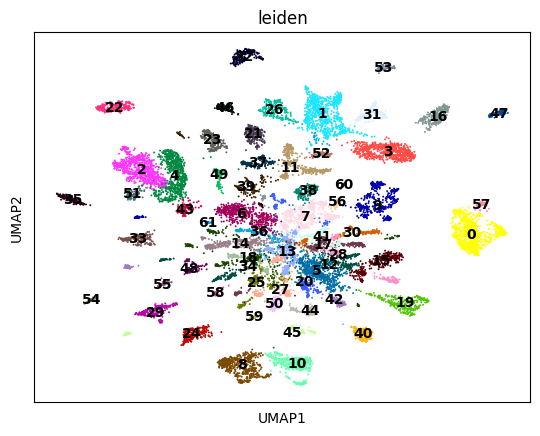
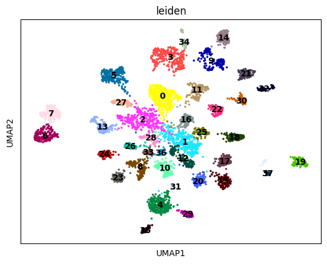
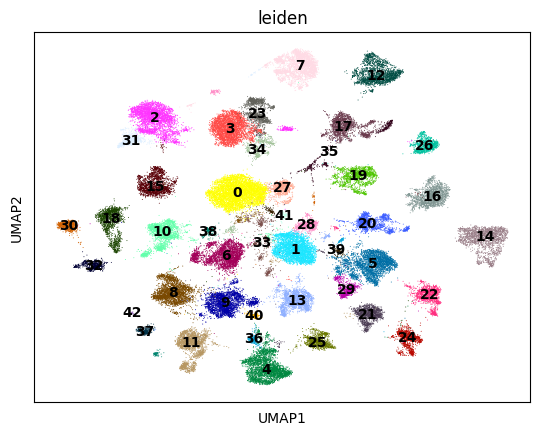

# Zebrafish Project 

We analyse Zebrafish LD, NMDA and control scRNASeq samples using scanpy. 

##  Quality Control Plots

These violin plots visualize cell-level quality metrics **before and after filtering** low-quality cells.

---

###  `violin_QC.png`

This plot shows **raw quality control metrics** (e.g., number of genes per cell, mitochondrial percentage) **before filtering**. It helps ide.pngy thresholds for removing low-quality or dead cells.

---

###  `violin_AfterQC.png`

This plot shows the same QC metrics **after filtering**. It confirms that poor-quality cells were successfully removed based on chosen thresholds.

## UMAP After Batch Effect Removal (Harmony)

### `umap_Harmonyzebrafishes.png`

This UMAP plot shows zebrafish single-cell data **after batch effect correction** using **Harmony**.

By aligning shared biological structure across different batches or samples, Harmony improves the clustering and visualization. Cells are now grouped primarily by **biological similarity** rather than technical batch differences, enabling more accurate downstream analysis.

### UMAP per sample

Below are the UMAP plots split by individual samples after reclustering:

### UMAP per sample

Below are the UMAP plots split by individual samples after reclustering:

## Clustering 

### UMAP after clustering (resolution: default =1)  

### Dot plot for Marker Genes

### Marker Genes UMAP 

## After annotation using marker genes

  

## We need to increase the resolution to 2.5 to seperate the tiny branch of Rod Cells

### UMAP after clustering 

## After re-Clustering annotation using marker genes

## Remove Celltype Cones_MG_MGPC_PostMitotic as likely doublet 

 

## Cell ratio after increasing resolution and re-annotations 

## Umap for Control,LD, and NMDA merged 

 

## Umap per sample 

### UMAPs of Major Retinal Cell Subtypes

The following UMAP plots illustrate the clustering of subtypes within each major retinal cell type. These visualizations highlight transcriptional diversity captured by single-cell RNA sequencing.

#### Cones Photoreceptor Subtypes before batch correction 
 

#### Cones Photoreceptor Subtypes after batch correction (STRICT PARAMETERS) 

 

#### Amacrine Cell (AC) Subtypes

#### AC Subtypes after batch correction (STRICT PARAMETERS) 

#### Retinal Ganglion Cell (RGC) Subtypes

#### RGC Subtypes after batch correction (STRICT PARAMETERS) 

#### Horizontal Cell (HC) Subtypes

#### HC Subtypes after batch correction (STRICT PARAMETERS) 

#### Bipolar Cell (BC) Subtypes

#### BC Subtypes after batch correction (STRICT PARAMETERS) 

#### MG Subtypes

#### MG Subtypes after batch correction (STRICT PARAMETERS) 

## How to run Snakemake 

For dry run to check everythign before actual run:

    snakemake -j1 -p --configfile config.yaml -n 

For Actual run: 
    

##### Update the configfile 

The config files has the sample names with the suffix in samples.tsv 
and the annotations in annotations.txt. Edit both files correspondingly. You can edit the config file to change their names. 

